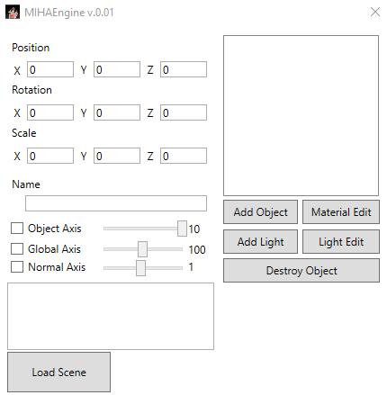
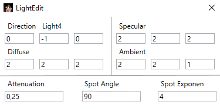
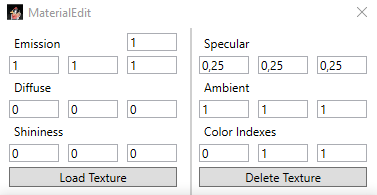
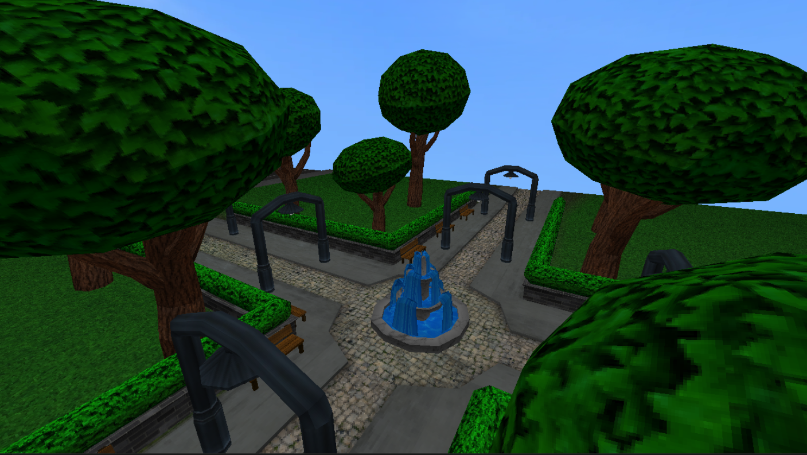
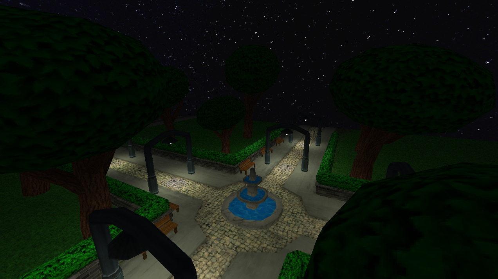

# Простой 3D движок на OpenTK

Этот проект представляет собой C# приложение, использующее библиотеку Open Toolkit (OpenTK), позволяющее пользователям создавать, управлять и манипулировать 3D объектами на сцене. Объекты импортируются в формате .obj, с возможностью установки текстур и изменения настроек материалов. Приложение поддерживает как обычные объекты, так и источники света, каждый со своими специфическими настройками.

## Возможности
### Управление объектами
- **Создание объектов:** Импорт и размещение 3D моделей в формате .obj на сцене.
- **Удаление объектов:** Удаление объектов со сцены.
- **Трансформации:** Регулировка положения, вращения и масштаба каждого объекта.
- **Названия:** Присвоение названий объектам для удобной идентификации.

### Типы объектов
### Обычные объекты
- **Настройки материалов:** emission (излучение), specular (зеркальность), ambient (окружение), shininess (блеск), индексы цветов.
- **Управление текстурами:** установка текстуры, удаление текстуры.
### Источники света
- **Свойства света:** direction (направление), diffuse (рассеянный свет), specular (зеркальный свет), ambient (окружающий свет), attenuation (затухание), spot angle (угол светового пучка), spot exponent (экспонента светового пучка).

## Настройки сцены и объектов
- **Сетка глобальных координат:** Включение или отключение отображения сетки глобальных координат.
- **Локальная система координат:** Включение или отключение отображения локальной системы координат для каждого объекта.
- **Нормали:** Включение или отключение отображения нормалей объектов.

## Установка
1. Клонирование репозитория:
```bash
    git clone https://github.com/Telanors/miha-engine.git
    cd <название директории>
```
2. Сборка проекта:
Откройте файл решения (.sln) в Visual Studio и соберите проект.
3. Запуск приложения:
Запустите приложение через Visual Studio или выполнив скомпилированный исполняемый файл.

## Демонстрация
### Интерфейс программы



### Пример сцены днем

### Пример сцены ночью

### Видео: 
https://disk.yandex.ru/i/NgUqeFdhf6EfzQ
